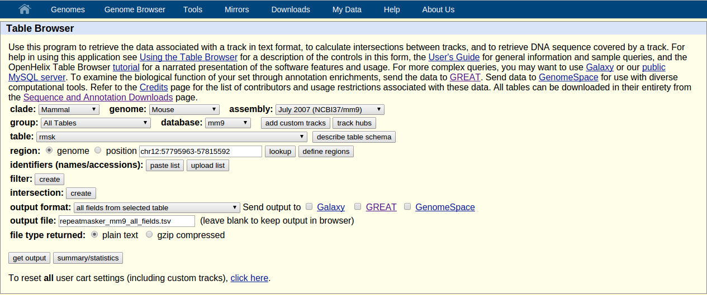
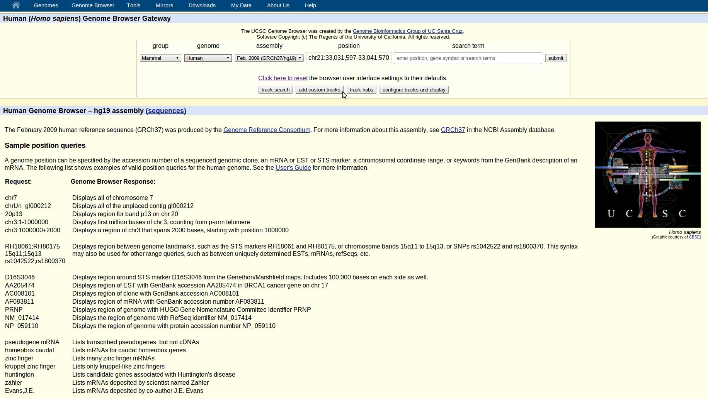
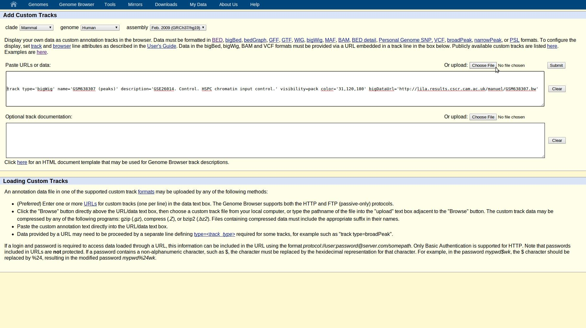

# WORKING WITH R

## How to make a Venn diagram from peaks files?

Using _Vennerable_, an *R* package available at *R-Forge*. Its installation may depends on any of the next packages.

```r
source("http://bioconductor.org/biocLite.R")
install.packages(c("graph", "RBGL"), dependencies=TRUE)
install.packages("Vennerable", repos="http://R-Forge.R-project.org")
```

After install it, load the required libraries and import your data.

```r
library(IRanges)
library(Vennerable)
library(GenomicRanges)
peaks = read.table( file="GSM0001.bed" )
colnames(peaks) = c("chr","start","end")
mygrange = GRanges( seqnames=peaks$chr,range=IRanges(start=peaks$start,end=peaks$end,names=paste(peaks$chr,peaks$start,peaks$end,sep="_")),strand="*" )
```

(*incomplete*...)


## How to install a package in *R*?

Hypothetically, you can install any package from the *CRAN* repository by using the `install.packages` function or using biocLite *Bioconductor* repository.

```rhttp://lila.results.cscr.cam.ac.uk/manuel/washu_results01.sorted.bed.gz
install.packages("ggplot2")
source("http://bioconductor.org/biocLite.R")
biocLite("ChIPpeakAnno")
```

Actually, these functions work rarely due to permission problems or version incompatibilities. You can check you current version of *R* by using the `--version` flag in the terminal. Alternatively, you can install any package not supported by your current version manually by using the *R* terminal commands with the `INSTALL` option.

```bash
R CMD INSTALL old_package.tar.gz
```


## How to create a *GRanges* from a *bed* file?<a id=GRanges></a>

*GRanges* (Genomic Ranges) is a class able to record genomic intervals. It allows to store basic information from a *bed* file type (chromosome, start/end coordinates and strand) as well as additional metadata (IDs, scores, etc...). To use it, first load the package and import the *bed* file using `read.table`. Later, give a name to the columns of your table and define the *GRanges* with it by using the `with` function.

```r
library('GenomicRanges')
table = read.table( file='sample_1068_paired_reads_1.resampled.bed' )
colnames(table) = c('chr','start','end','strand','id','score')
paired_reads_1 = with(table,GRanges(chr, IRanges(start, end), strand, id=id, flag=score))
```

You can also stored several `GRanges` denoting paired-end reads in a single object.

```r
table = read.table( file='sample_1068_paired_reads_2.resampled.bed' )
colnames(table) = c('chr','start','end','strand','id','score')
paired_reads_2 = with(table,GRanges(chr, IRanges(start, end), strand, id=id, flag=score))
reads = list( paired_reads_1,paired_reads_2 )
names(reads) = c('paired_reads_1','paired_reads_2')
```


## How to create a bed file from a *GRanges*?

First, create your own *GRanges* variable (find it out [here](#GRanges)) or load it from any *.Rda* file using `load`.

```r
load('genomic_ranges.Rda')
ls()
#  [1]   "paired_reads_1"   "paired_reads_2"
class(paired_reads_1)
#  [1] "GRanges"
#  attr(,"package")
#  [1] "GenomicRanges"
paired_reads_1[1]
#  GRanges with 1 range and 2 metadata columns:
#        seqnames               ranges strand |                                         id      flag
#           <Rle>            <IRanges>  <Rle> |                                <character> <integer>
#    [1]       14 [73565650, 73565700]      - |    KL136:231:D28EKACXX:6:1101:10000:100839       115
```

Create a *data-frame* with your selected features-metadata and write it into a file using `write.table`.

```r
gr <- filtered$paired_reads_1
df <- data.frame(chr=as.character(seqnames(gr)),starts=start(ranges(gr)),ends=end(ranges(gr)), strand=as.character(strand(gr)),id=c(gr$id),flag=c(gr$flag))
write.table(df,file="paired_reads_1.bed",quote=F,sep="\t",row.names=F,col.names=F)
```

# WORKING ON CLUSTERS

Next is described how to work on a cluster running `TORQUE` and `MAUI`. Commands, may be different when any other queuing or scheduler is considered.

## How to work within a terminal on the cluster?

To connect to the head node of the cluster use `ssh`, as to connect to any other remote machine. Do not run any job in this frontend node. Instead, request a working node to the queuing system by using `qsub`.

```bash
ssh $CLUSTER
qsub -I
```

The `-I`  parameter will request an interactive shell environment in the default queue. To request an terminal in any other queue, use the `-q` option.

```bash
qsub -I -q long
```

Some parametes related to this new bash environment on the current working node are stored in Portable Batch System (PBS) variables.

```bash
qsub -q immediate -I
echo $PBS_JOBID     # the current job identifier
echo $PBS_O_WORKDIR # the current working directory
```

## How to submit jobs to the queue?

To submit any job, just use `qsub` followed by the bash script you want run. Optionally use `-q` to choose any other queues. You may also consider the use of `-m` to report by email when the job is terminated or aborted.

```bash
qsub -q immediate -m ae script.sh
```

To submit a large number of jobs, as you might be interested in parallel tasks, send the script as an array by using `-t`.

```bash
qsub -q immediate -t 1-100 script.sh
```

> An array of jobs will execute the same script a given number of times. Take this into account to not overwrite the same working/output files. To redirect the outputs of each job in the array to different files, consider the use of the `#PBS_ARRAYID` variable in your script.


## How to monitor, manage and kill jobs?

To list the details of jobs submitted by any user use `showq`. You may consider to filter them by piping the output to a `grep` command.

```bash
showq | grep "Running"
```

Alternatively, you can use the `qstat` command from the queuing system to check the status of the jobs, the queues and the PBS server.

```bash
qstat -a # lists submitted jobs
qstat -t # lists submitted jobs, expanding the the ones submitted in arrays
qstat -q # lists available queues
```

After running a job, you will have two files with the same name of you script, followed by an **o** or **e** and the job identifier, capturing the standar output and the errors during the execution of the script.

```bash
qstat -a
# Job id            Name      ...
# ------            ----      ...
# 12345[].$CLUSTER  script.sh ...
for k in $( seq 1 100 ) ; then qdel 12345[$k] ; done
```

You can kill and remove from the queue any job by parsing its idenfier to `qdel`. To kill an arrays of jobs, you will need to kill each subjob in the array one by one. Consider the use of a loop to perform this task.


## How to run parallel jobs?

The best way to run parallel jobs on a cluster is to submit them as an array and interacting with the PBS variables. Next script is a toy example that shows how to compute the rows of a 100x100 matrix in parallel.

```bash
#!/bin/bash

#PBS -t 1-100
#PBS -l walltime=8:00:00

## PARAMETERS ##########################################################
   TEMPFOLDER=~/tempfolder.$PBS_ARRAYID
   mkdir -p $TEMPFOLDER
   OUTPUTFILE=~/results.$PBS_ARRAYID.txt
########################################################################

$i=$PBS_ARRAYID
echo -n row_$i > $OUTPUTFILE
for j in $( seq 1 100 ) ; do
  echo -n $'\t'$(( $i + $j )) >> $OUTPUTFILE
done

echo "" >> $OUTPUT
rm -rf  $TEMPFOLDER
```

Then, use `qsub` as usual to submit the job array to the cluster. Note that some PBS parameters can be defined in the header of the document instead of parsing them as a `qsub` option. 

```bash
qsub -q short script.sh
```


# WORKING ON SERVERS

## How to check if a program is installed  ?

Using the `ssh` file system client. In the next example, the folder called *codex* is mounted as a local drive under the name *superhanz*.

```bash
sshfs -o idmap=user ms2188@superhanz.cscr.cam.ac.uk:codex/ superhanz
```


## How to mount a server as a local drive?

Using the `ssh` file system client. In the next example, the folder called *codex* is mounted as a local drive under the name *superhanz*.

```bash
sshfs -o idmap=user ms2188@superhanz.cscr.cam.ac.uk:codex/ superhanz
```


## How to limit the amount of memory to use?

Using the `ulimi` command you can control the resources of the server. This command is available on package `util-serve`. Use `-a` option to list all possible features to be set. To get the current value of any feature, just use the option without parsing any value.

```bash
sudo aptitude search util-vserver
ulimit -a
#  core file size          (blocks, -c) 0
#  data seg size           (kbytes, -d) unlimited
#  b&
ulimit -d
#  unlimited
```

To limit resources to any feature, use the corresponding flag followed by the limit you want to set. For instance, if you want to limit the memory by the half of the maximum available, use `-m` followed by your limit in kilobytes. You can check the total and free memory by using the `free` command. Use `unlimited` to restore it to default.

```bash
free
#               total       used       free     shared    buffers     cached
#  Mem:      60000000   10000000   50000000          0      19900    9520784
#  -/+ buffers/cache:   42010312   23954420
#  Swap:     78977020      53180   78923840
ulimit -m 30000000 ; ./script.sh ; ulimit -m unlimited
```


## How to set scheduled jobs?

Using the `crond` daemon. This program should be running since the computer was reboot.

```bash
ps -ef | grep crond
```


To get access to the schedules jobs, use the `crontab` command. The `-l` option will list all actived jobs. 

```bash
crontab -l
```

To edit it, use the `-e` option. Add a new line to set a new scheduled job. The timestamp format is:

## How to backup a MySQl database?

Using the `mysqldump` command.

```bash
mysqldump -u $USER -p$PASSWORD $STAGINGDB > staging.sql
mysqldump -u $USER -p$PASSWORD $BIOINFORMATICSDB > bioinformatics.sql
```


## How to run parallel jobs?

Using the `parallel` command. Use brackets in the statement as the input source, with the arguments placed after the triple colon.

```bash
parallel -help
parallel 'gunzip {}' ::: ls *-*/*.fq.gz
parallel 'fastqc --quiet -f fastq {}' ::: ls *-*/*.fastq
parallel 'gzip -f {}' ::: ls */*-*.fastq
```


## How to create a symbolic link?

Using the `ln` command. You can use `df` to browse your disk file system.

```bash
df -h
#Filesystem            Size  Used Avail Use% Mounted on
#/dev/sdc1              37G  5.5G   30G  16% /
#/dev/sdb1             2.7T  1.9T  672G  75% /projects
#/dev/sda1             2.7T  2.4T  234G  92% /home
#//pacific/gottgens/    22T   21T  963G  96% /home/rlh60/Pacific
#//pacific/huntly/      19T  9.1T  9.2T  50% /home/rlh60/Brian_Pacific
#apollo:/export/data    19T  5.7T   12T  33% /data
#...
cd
ln -s /data
ls -l
```

You can also create symbolic links of your favourites programs into **/bin** to avoid using the full path.

```bash
# do not use the full path to your programs
/home/Programs/bowtie-0.12.9/bowtie -m 1 -v 2 -S --phred33-quals hg19_ucsc A006.fastq > A006.sam
# use a symbolic link instead
ln -s /home/Programs/bowtie-0.12.9/bowtie /bin
bowtie -m 1 -v 2 -S --phred33-quals hg19_ucsc A006.fastq > A006.sam
```


## How to manage RSA keys for authentication?

Using `ssh-keygen` you can generate private-public key pairs. Donbt use a *passphrase* to avoid user monitoring every time you want to login.

```bash
ssh ms2188@runic
ssh-keygen -t rsa -C "RSA key from ms2188@runic"
#Created directory '/home/ms2188/.ssh'.
#Enter passphrase (empty for no passphrase):
#Enter same passphrase again:
#Your identification has been saved in /home/ms2188/.ssh/id_rsa.
#Your public key has been saved in /home/ms2188/.ssh/id_rsa.pub.
#...
cat .ssh/id_rsa.pub
```

Now just add your *public key* into the *authorized keys* file in the server of interest.

```bash
ssh ms2188@superhanz
nano .ssh/authorized_keys
```

> To speed up the connection between servers, consider to set an alias such as `alias superhanz="ssh ms2188@superhanz"`.


## How to work safely in the server?<a id="screen"></a>

Using `screen` you can have multiple virtual terminals with just one physical process. 

```bash
screen --help
```

Once you have connected to your dedicated server, `screen` allows you to create a virtual session on multiple windows.

```bash
ssh runic
screen
```

A good practice is to invoke `screen` by parsing a session name using the `-S` option. 

```bash
screen -S myscreen
```

Instead of shell commands, screen uses <kbd>Ctrl</kbd>+<kbd>a</kbd> as a signal to send commands. To get help, just use <kbd>Ctrl</kbd>+<kbd>a</kbd> and  <kbd>?</kbd> . To exit and kill the active screen use  <kbd>Ctrl</kbd>+<kbd>a</kbd>  and   <kbd>k</kbd> . If you need to close your session, detach `screen` by using  <kbd>Ctrl</kbd>+<kbd>a</kbd>  and  <kbd>d</kbd> . Later, you can list your virtual sessions and re-attach then.

```bash
ssh ms2188@tropic
screen -ls
#There is a screen on:
#	24298.myscreen		(01/08/13 11:25:00)	(Detached)
#	24254.pts-0.tropic	(01/08/13 11:26:00)	(Detached)
#1 Socket in /var/run/screen/S-ms2188.
screen -r 24298
```

> To improve your experience using `screen`, consider to customize the environment by setting up your `.screenrc` screen. For example:  [.screenrc](https://github.com/mscastillo/bash/blob/master/.screenrc).


# PROCESSING DATA


## How to choose random regions from a genome?

If the random regions should be biologically relevant (not falling in centromeres nor telomeres), use the repeat masker table which screens DNA sequences for interspersed repeats and low complexity DNA sequences.

For getting a recent version of this table, go to UCSC table menu and choose the *rmsk* table from your selected genome.



After download it, use `awk` and `shuf` to grab the columns with the genomic coordinates and randomly choose a given number of them.

```
cat repeatmasker_mm9_all_fields.tsv | awk 'BEGIN{OFS="\t";OFMT="%.f"}{print $6,($7+$8)*0.5-200,($7+$8)*0.5+200}' > repeatmasker_mm9_peaks_400bp.bed
shuf -n 1000 repeatmasker_mm9_peaks_400bp.bed > random_peaks.bed
```


## How to digest a genome?

Using `hicup_digester` to generate a restriction fragment file in bed format. This program belongs to the HiCup suite (available at http://bioinformatics.babraham.ac.uk/projects) that requires an input genome, in fasta format, the sequence pattern and the cleavage site recognised by the enzyme of interest. 

```bash
hicup_digester -1 A^AGCTT,HindIII m*.fa
```


## How to convert FASTQ format to FASTA format?

Combining `cat` and `perl` commands.

```bash
cat file_in.fastq | perl -e '$i=0;while(<>){if(/^\@/&&$i==0){s/^\@/\>/;print;}elsif($i==1){print;$i=-3}$i++;}' > file_out.fasta
```


## How to align fastq files?

Aligners: (*i*) `bwa`, (*ii*) `bowtie2` and (*iii*) `tophat`.

### bwa

First check that you have generated an index for your mapping genome. If not, you can generate it using the `index` option.

```bash
#  copy the fasta file into the folder you want to store the index
cd /usr/local/bin/bwa/index/human/hg19
cp ~/hg19.fa .
bwa index hg19.fa
```

To perform the alignment, use the `mem` option to get directly a SAM file format.  This option will use the BWA-MEM algorithm. Alternatively, you can use `bwasw` to have additional penalty and gap options. Use the `-t` option to control the number of cores to use.

```bash
bwa mem -t 4 -R "@RG\tID:mysample" /usr/local/bin/bwa/index/human/hg19/hg19.fa ~/data/mysample.fastq > mysample.sam
```


When having paired-end reads, provided the two mates of each pair in two single files.

```bash
bwa mem -t 4 -R "@RG\tID:mypesample" /usr/local/bin/bwa/index/human/hg19/hg19.fa ~/data/mypesample_1.fastq ~/data/mypesample_2.fastq  > mypesample.sam
```

### bowtie2

Once again, generate the corresponding index to your mapping genome by using `bowtie2-build`.

```bash
# copy the fasta file into the folder you want to store the index
cd /usr/local/bin/bowtie2/index/human/hg19
cp ~/hg19.fa .
bowtie2-build hg19.fa hg19.fa
```

Once your index is ready, run `bowtie2` with `-q` option for inputs in fastq format and parse the index by using the `-x` option. For multicore options use -`p`. Use `-U` to parse a coma separated list of inputs (or a single file) and `-S` to have the output in *sam* format.

```bash
bowtie2 -q -p 4 -x /usr/local/bin/bowtie2/index/human/hg19/hg19.fa -U ~/data/mysample.fastq -S ~/data/mysample.sam
```

### tophat2

Top hat uses bowtie indexes. See how to create it above.

```bash
#  copy the fasta file into the folder you want to store the index
cd /usr/local/bin/bowtie2/index/human/hg19
cp ~/hg19.fa .
bowtie2 hg19.fa hg19.fa
```


## How to split paired-end reads from a BAM/SAM file?

Using the `samtools` with the `view` option for extracting a subset of reads from a *sam* or a *bam* file. To filter out the reads we are not interested in, use the `-f` option and specify which flag (in hexadecimal format) should contain the reads to keep. For the first and second pairs, use the *0x0040* and *0x0080* flags respectively. Use the `-bh` options to get a BAM format output with its corresponding header.

```bash
samtools view -bh -f 0x0040 sample.bam > sample_paired_reads_1.bam
samtools view -bh -f 0x0080 sample.bam > sample_paired_reads_2.bam
```


## How to visualize long-range chromosomal interactions?

Using the *WashU Epigenome Browser* ([WUEB](http://epigenomegateway.wustl.edu/)). The WUEB requires paired-end bed file (tab-separated) with the next format: (*i*) chromosome name, (*ii*) start, (*iii*) end,  (*iv*) coordinate of the mate and a score of the interaction separated by commas, (*v*) identifier (a unique non-negative integer) and (*vi*) the strand (use a dot if unknown it).

```bash
echo 'chr1   111   222   chr2:333-444,55   1   .' >  mybed.bed
echo 'chr2   333   444   chr1:111-222,55   2   .' >> mybed.bed
echo 'chr3   777   888   chr2:777-888,31   1   +' >> mybed.bed
echo 'chr3   555   666   chr1:555-666,31   2   -' >> mybed.bed
```

The *bed* file should be sorted and compressed with `bgzip`. Use the `bedSort` tool from the [UCSC programs](http://hgdownload.cse.ucsc.edu/admin/exe/) instead of using any other sorting function. Then, use `tabix` to generate an index of the sorted and compressed bed file.

```bash
bedSort mybed.bed mybed.sorted.bed
cat mybed.sorted.bed
#chr1   111   222   chr2:333-444,55   1   .
#chr2   333   444   chr1:111-222,55   2   .
#chr3   555   666   chr1:555-666,31   2   -
#chr3   777   888   chr2:777-888,31   1   +
bgzip mybed.sorted.bed
tabix -p bed mybed.sorted.bed.gz
```

Later, upload both files to your server and load the data track into the WUEB by parsing the url of the compressed bed file.


## How to process ChIP-seq data from GEO?

Use `get_data` to process samples from GEO. This script is available on tropic and runic.

```bash
ssh tropic
get_data --help
```

This utility will automatically download the *sra* files and transform them to raw *fastq* format. Then, it will run `fastqc` to check the quality on each *fastq* file. It will trim the adapters and overrepresented sequences (if present). Later, it will merge the *fastq* files and will run `bowtie2`.

```bash
get_data -g GSE26014 -m GSM638307 -s SRX/SRX038/SRX038907 -x hg10
```
`get_data` will create a deep structure of folders to store the output files in your current directory.

> Before start processing any sample, check which server has less jobs running and if you have enough free disk space by using  `top` (use <kbd>q</kbd> to quit) or  `ps -aF` and `df -h`.


## How to process a batch of ChIP-Seq data?

Writing a shell script with all the command lines. The script must start with the *shebang* interpreter line. Subsequently, add the commands you want to execute. For a large batch, consider to save the standard outputs into a log file.

```bash
#! /bin/bash
date > batch.log
# first sample
get_data -g GSE26014 -m GSM638307 -s SRX/SRX038/SRX038907 -x hg19 >> batch.log
sam2bigWIG -g GSE26014 -m GSM638307 -x hg19 >> batch.log
date >> batch.log
# second sample
get_data -g GSE26014 -m GSM638308 -s SRX/SRX038/SRX038908 -x hg19 >> batch.log
date >> batch.log
sam2bigWIG -g GSE26014 -m GSM638308 -x hg19 >> batch.log
date >> batch.log
```

Before execute your script, check whether it is executable.

```bash
chmod u+x batch.sh
./batch.sh
```

Alternatively, you can run it in the background and monitor the progress by displaying the log file.

```bash
./batch.sh &
tail -f batch.log
```

> For jobs that might take a long time to finish, it is highly recommended the use of `screen` (check it how [here](#screen)).


## How to process replicated ChIP-seq data?

Performing a correlation test with `sam2bigWig` between the two samples. Given one of the samples, use the `-c` flag to pass the pre-processed bigwig file of the second one.

```bash
sam2bigWig -g GSE26014 -m GSM638311 -x hg19
sam2bigWig -g GSE26014 -m GSM638310 -x hg19 -c GSE26014/GSM638311/GSM638311.bw >> batch.log
#...
#==> Running wigCorrelate
#   - correlation: 0.974446
```

If the correlation between them is high than a threshold (typically 0.8) merge the *fastq* files previously processed with `get_data`. Otherwise, consider them as different samples.

```bash
correlation="$(grep 'correlation: * [0-9].[0-9]*' batch.log | grep -o [0-9].[0-9]*)"
echo $correlation
# 0.974446
mkdir GSE26014/GSM638310-11
cat GSE*/GSM638310/GSM638310.fastq GSE*/GSM638311/GSM638311.fastq > GSE*/GSM638310-11/GSM638310-11.fastq
```

Subsequently, re-run `get_data` with the `--merged` flag to process the concatenate *fastq* file and `sam2bigWig` to compute the final bed files.

```bash
get_data -g GSE26014 -m GSM638310-11 -x hg19 --merged
sam2bigWig -g GSE26014 -m GSM638310-11 -x hg19
```


## How to process peak files in bigWig format?

Using the `run_MACS2` *Perl* script. This script requires the bed files of two samples, the experimental and the control one, and a p-value or q-value cutt-off. The output are two files in bed and a bigBed formats, both with a peak length of 400bp.

```bash
cd GSE26014/GSM638310-11
run_MACS2.pl GSM638310-11.BED ../../GSE26014/GSM638307/GSM638307.BED hg19 -p 1e-5
cd ../..
```

> The *Perl* script described above has been replaced in the pipeline by a *Bash* script called `run_macs2`. Use the `-h`  parameter for additional details.


## How a pipeline shell-script should looks like?

```bash
#!/bin/bash

date >> batch.log
echo '# NEW BATCH' >> batch.log

date >> batch.log
echo '# PROCESSING INDIVIDUAL FASTQ FILES' >> batch.log

date >> batch.log
get_data -g GSE26014 -m GSM638310 -s SRX/SRX038/SRX038910 -x hg19 >> batch.log

date >> batch.log
get_data -g GSE26014 -m GSM638311 -s SRX/SRX038/SRX038911 -x hg19 >> batch.log

date >> batch.log
echo '# PROCESSING SAM FILES' >> batch.log

date >> batch.log
sam2bigWig -g GSE26014 -m GSM638310 -x hg19 >> batch.log

date >> batch.log
sam2bigWig -g GSE26014 -m GSM638311 -x hg19 -c GSE26014/GSM638310/GSM638310.bw >> batch.log

date >> batch.log
echo '# CORRELATION TEST' >> batch.log
CORRELATION="$(grep 'correlation: * [0-9].[0-9]*' batch.log | grep -o [0-9].[0-9]*)"

if [ $(bc <<< "$CORRELATION >= 0.8") ] ; then

 date >> batch.log
 echo "# MERGING FASTQ FILES (CORRELATION = $CORRELATION)"
 cd GSE26014
 mkdir GSM638310-11
 cat GSM638310/GSM638310.fastq GSM638311/GSM638311.fastq > GSM638310-11/GSM638310-11.fastq
 cd ..

 date >> batch.log
 echo '# REPROCESSING MERGED FASTQ FILES' >> batch.log
 get_data -g GSE26014 -m GSM638310-11 -x hg19 --merged >> batch.log

 date >> batch.log
 echo '# REPROCESSING SAM FILES' >> batch.log
 sam2bigWig -g GSE26014 -m GSM638310-11 -x hg19 >> batch.log

 date >> batch.log
 cd GSE26014/GSM638310-11
 run_MACS2.pl GSM638310-11.BED ../../GSE26014/GSM638307/GSM638307.BED hg19 -p 1e-7 >> ../../batch.log

 date >> batch.log
 run_MACS2.pl GSM638310-11.BED ../../GSE26014/GSM638307/GSM638307.BED hg19 -p 1e-5 >> ../../batch.log

 date >> batch.log
 run_MACS2.pl GSM638310-11.BED ../../GSE26014/GSM638307/GSM638307.BED hg19 -p 1e-3 >> ../../batch.log

 date >> batch.log
 echo '# UPLOADING FILES TO SUPERHANZ' >> batch.log
 scp GSM638310-11*.b[b,w] lila@superhanz.cscr.cam.ac.uk:htdocs/manuel/

 cd ../..

else

 date >> batch.log
 echo "# CONTINUING WITHOUT MERGING FILES (CORRELATION = $CORRELATION)"

 date >> batch.log
 cd GSE26014/GSM638310
 run_MACS2.pl GSM638310.BED ../../GSE26014/GSM638307/GSM638307.BED hg19 -p 1e-7 >> ../../batch.log

 date >> batch.log
 cd GSE26014/GSM638310
 run_MACS2.pl GSM638310.BED ../../GSE26014/GSM638307/GSM638307.BED hg19 -p 1e-5 >> ../../batch.log

 date >> batch.log
 cd GSE26014/GSM638310
 run_MACS2.pl GSM638310.BED ../../GSE26014/GSM638307/GSM638307.BED hg19 -p 1e-6 >> ../../batch.log

 date >> batch.log
 echo '# UPLOADING FILES TO SUPERHANZ' >> batch.log
 scp GSM638310*.b[b,w] lila@superhanz.cscr.cam.ac.uk:htdocs/manuel/

 cd ../..

 date >> batch.log
 cd GSE26014/GSM638311
 run_MACS2.pl GSM638311.BED ../../GSE26014/GSM638307/GSM638307.BED hg19 -p 1e-7 >> ../../batch.log

 date >> batch.log
 run_MACS2.pl GSM638311.BED ../../GSE26014/GSM638307/GSM638307.BED hg19 -p 1e-5 >> ../../batch.log

 date >> batch.log
 run_MACS2.pl GSM638311.BED ../../GSE26014/GSM638307/GSM638307.BED hg19 -p 1e-3 >> ../../batch.log

 date >> batch.log
 echo '# UPLOADING FILES TO SUPERHANZ' >> batch.log
 scp GSM*.b[b,w] lila@superhanz.cscr.cam.ac.uk:htdocs/manuel/

 cd ../..

fi
```


## How to display peak files?

Using the [Genome Browser Gateway](http://genome-euro.ucsc.edu/cgi-bin/hgGateway) from the USCS site. For a given genome of reference, custom tracks can be uploaded and displayed together.



Different file types are supported. Depending on the format, the peaks profiles may be uploaded or they must be passed through a link.



Some file types, as *bed*, must be uploaded from your local drive. You can copy your records from your pipeline results' folder to your local computer by using `scp`.

```bash
scp ms2188@tropic:pipeline/manuel/GSE26014/GSM638310-11/GSM638310-11_p1e-5_400bp.bed ./Downloads
```

Heavier file types, as *bigWig* and *bigBed*, must be retrieved by URL. Use superhanz to upload your files by using `scp`. By default, use the lila user and copy your files in your own folder, inside the htdocs one.

```bash
scp GSE26014/GSM638307/GSM638307.bw lila@superhanz.cscr.cam.ac.uk:htdocs/manuel/
```


To display your binding profile from the server, you have to complete a track line per sample with the URL and some additional information.

```bash
track type='bigWig' bigDataUrl='http://lila.results.cscr.cam.ac.uk/manuel/GSM638307.bw' name='GSM638307. Peaks. bigWig.' description='Control. GSE26014. HSPC chromatin input control.' visibility=pack color='31,120,180' 

track type='bigWig' bigDataUrl='http://lila.results.cscr.cam.ac.uk/manuel/GSM6383110-11.bw' name='GSM6383140-11. Peaks. bigWig.' description='Merged. GSE26014. Chromatin IP against PU.1 in HSPC.' visibility=pack color='31,120,180'

track type='bigBed' bigDataUrl='http://lila.results.cscr.cam.ac.uk/manuel/GSM638310-11_p1e-7.bb' name='GSM638310-11. bigBed. p1e-7' description='Merged. GSE26014. Chromatin IP against PU.1 in HSPC. p1e-7' visibility=pack color='31,120,180' 

track type='bigBed' bigDataUrl='http://lila.results.cscr.cam.ac.uk/manuel/GSM638310-11_p1e-5.bb' name='GSM638310-11. bigBed. p1e-5' description='Merged. GSE26014. Chromatin IP against PU.1 in HSPC. p1e-7' visibility=pack color='31,120,180' 

track type='bigBed' bigDataUrl='http://lila.results.cscr.cam.ac.uk/manuel/GSM638310-11_p1e-3.bb' name='GSM638310-11. bigBed. p1e-3' description='Merged. GSE26014. Chromatin IP against PU.1 in HSPC. p1e-7' visibility=pack color='31,120,180' 
```
